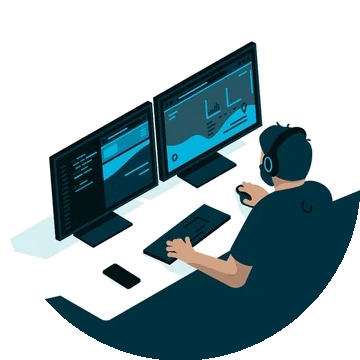

<h1 align="center">Hi 👋, I'm Abdul</h1>
<h3 align="center">
Fullstack Developer  
CS @ CCNY</h3>

<!-- <h4 align="left">Connect with me!</h4>

-  Abdul Andha 
- 📧 aandha8342@gmail.com

 -->

  

<h3>About me</h3>
➤ Currently looking for internships  
➤ Based In: New York City  
➤ Look at my **<a align="center" href="https://drive.google.com/file/d/1JqCgPuNtUTr2JKiHf0zW3WDBAdzsH8ae/view?usp=sharing" target="_blank">Resume</a>**  
➤ Check out my **<a align="center" href="https://www.linkedin.com/in/abdul-andha/" target="_blank">LinkedIn</a>**  
➤ Contact me: **aandha8342@gmail.com**

<!--
**Abdul-Andha/Abdul-Andha** is a ✨ _special_ ✨ repository because its `README.md` (this file) appears on your GitHub profile.

Here are some ideas to get you started:

-> I’m currently working on ...
- 🌱 I’m currently learning ...
- 👯 I’m looking to collaborate on ...
- 🤔 I’m looking for help with ...
- 💬 Ask me about ...
- 📫 How to reach me: ...
- 😄 Pronouns: ...
- ⚡ Fun fact: ...
-->
